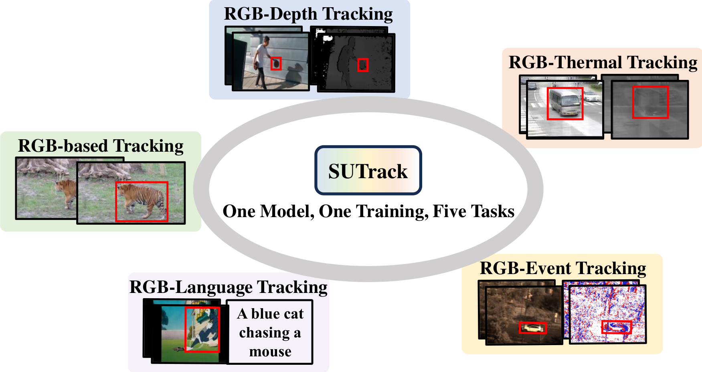
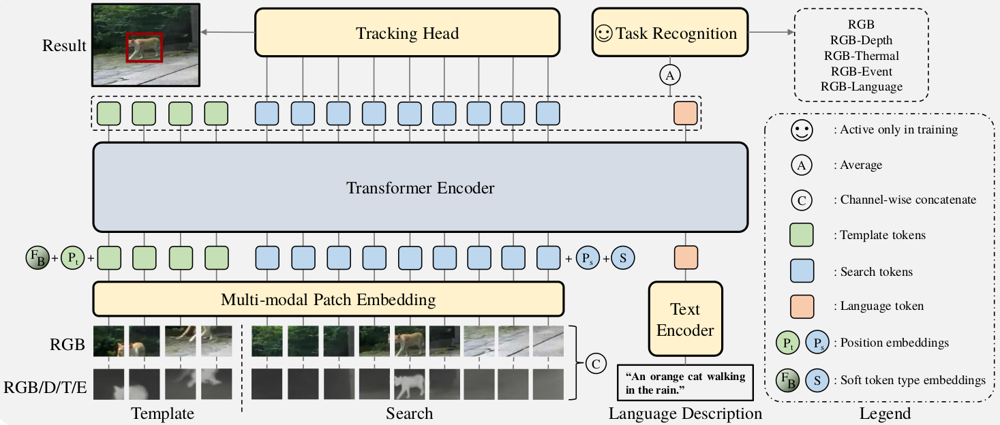

# SUTrack

> [**SUTrack: Towards Simple and Unified Single Object Tracking**](https://pan.baidu.com/s/10cR4tQt3lSH5V2RNf7-3gg?pwd=pks2)<br>
> accepted by AAAI2025<br>
> [Xin Chen](https://scholar.google.com.hk/citations?user=A04HWTIAAAAJ), [Ben Kang](https://scholar.google.com.hk/citations?user=By9F6bwAAAAJ), Wanting Geng, [Jiawen Zhu](https://scholar.google.com.hk/citations?user=j_gYsS8AAAAJ), Yi Liu, [Dong Wang](http://faculty.dlut.edu.cn/wangdongice/zh_CN/index.htm), [Huchuan Lu](https://ice.dlut.edu.cn/lu/)

This is an official pytorch implementation of the paper SUTrack: Towards Simple and Unified Single Object Tracking, a new unified framework for single- and multi-modal object tracking.

## Highlights
### Unified Tracking Model
In this paper, we propose a simple yet unified single object tracking (SOT) framework, dubbed SUTrack. It consolidates five SOT tasks (RGB-based, RGB-Depth, RGB-Thermal, RGB-Event, RGB-Language Tracking) into a unified and simple model trained in a single session.



### Simple architecture

SUTrack unifies different modalities into a unified representation and trains a Transformer encoder.




### Strong performance
#### RGB-based Tracking:
| Tracker     | LaSOT (AUC) | GOT-10K (AO) | TrackingNet (AUC) |
|-------------|-------------|--------------|-------------------|
| **SUTrack** | **75.2**    | **81.5**     | **87.7**          |
| LoRAT       | 75.1        | 77.5         | 85.6              |
| ODTrack     | 74.0        | 78.2         | 86.1              |
| ARTrackV2   | 73.6        | 79.5         | 86.1              |
| SeqTrack    | 72.5        | 74.8         | 85.5              |


#### Multi-Modal Tracking:
| Tracker     | LasHeR (AUC) | RGBT234 (MSR) | VOT-RGBD22 (EAO) | DepthTrack (F-score) | VisEvent (AUC) | TNL2K (AUC) |
|-------------|--------------|---------------|------------------|----------------------|----------------|-------------|
| **SUTrack** | **61.9**     | **70.8**      | **76.6**         | **66.4**             | **64.0**       | **67.9**    |
| SeqTrackv2  | 61.0         | 68.0          | 74.8             | 62.3                 | 63.4           | 62.4        |
| OneTracker  | 53.8         | 64.2          | 72.7             | 60.9                 | 60.8           | 58.0        |
| SDSTrack    | 53.1         | 62.5          | 72.8             | 61.9                 | 59.7           | -           |
| Un-Track    | -            | 62.5          | 72.1             | 61.0                 | 58.9           | -           |
| ViPT        | 52.5         | 61.7          | 72.1             | 59.4                 | 59.2           | -           |

#### Efficient RGB-based Tracking:
| Tracker          | LaSOT (AUC) | GOT-10K (AO) | TrackingNet (AUC) | CPU Speed (FPS) | AGX Speed (FPS) |
|------------------|-------------|--------------|-------------------|-----------------|-----------------|
| **SUTrack-T224** | **69.6**    | **72.7**     | **82.7**          | 23              | 34              |
| HiT              | 64.6        | 64.0         | 80.0              | 33              | 61              |
| MixformerV2-S    | 60.6        | -            | 75.8              | 30              | -               |
| HCAT             | 59.3        | 65.1         | 76.6              | 45              | 55              |
| FEAR             | 53.5        | 61.9         | -                 | 60              | 38              |

## Install the environment
```
conda create -n sutrack python=3.8
conda activate sutrack
bash install.sh
```
* Add the project path to environment variables
```
export PYTHONPATH=<absolute_path_of_SUTrack>:$PYTHONPATH
```

## Data Preparation
Put the tracking datasets in [./data](data). It should look like:

For RGB tracking:
   ```
   ${SUTrack_ROOT}
    -- data
        -- lasot
            |-- airplane
            |-- basketball
            |-- bear
            ...
        -- got10k
            |-- test
            |-- train
            |-- val
        -- coco
            |-- annotations
            |-- images
        -- trackingnet
            |-- TRAIN_0
            |-- TRAIN_1
            ...
            |-- TRAIN_11
            |-- TEST
   ```
For Multi-Modal tracking (RGB-T234 and otb_lang is only for evaluation, thus can be ignored for training):
   ```
   ${SUTrack_ROOT}
    -- data
        -- depthtrack
            -- train
                |-- adapter02_indoor
                |-- bag03_indoor
                |-- bag04_indoor
                ...
        -- lasher
            -- trainingset
                |-- 1boygo
                |-- 1handsth
                |-- 1phoneblue
                ...
            -- testingset
                |-- 1blackteacher
                |-- 1boycoming
                |-- 1stcol4thboy
                ...
        -- RGB-T234
            |-- afterrain
            |-- aftertree
            |-- baby
            ...
        -- visevent
            -- train
                |-- 00142_tank_outdoor2
                |-- 00143_tank_outdoor2
                |-- 00144_tank_outdoor2
                ...
            -- test
                |-- 00141_tank_outdoor2
                |-- 00147_tank_outdoor2
                |-- 00197_driving_outdoor3
                ...
            -- annos
        -- tnl2k
            -- train
                |-- Arrow_Video_ZZ04_done
                |-- Assassin_video_1-Done
                |-- Assassin_video_2-Done
                ...
            -- test
                |-- advSamp_Baseball_game_002-Done
                |-- advSamp_Baseball_video_01-Done
                |-- advSamp_Baseball_video_02-Done
                ...
        -- lasot
            |-- airplane
            |-- basketball
            |-- bear
            ...
        -- otb_lang
            -- OTB_videos
                |-- Basketball
                |-- Biker
                |-- Bird1
                ...  
            -- OTB_query_train
                |-- Basketball.txt
                |-- Bolt.txt
                |-- Boy.txt
                ...  
            -- OTB_query_test
                |-- Biker.txt
                |-- Bird1.txt
                |-- Bird2.txt
                ...  
   ```

## Set project paths
Run the following command to set paths for this project
```
python tracking/create_default_local_file.py --workspace_dir . --data_dir ./data --save_dir .
```
After running this command, you can also modify paths by editing these two files
```
lib/train/admin/local.py  # paths about training
lib/test/evaluation/local.py  # paths about testing
```

### Train SUTrack
The pretrained backbone models can be downloaded here [[Google Drive]](https://drive.google.com/drive/folders/1Ut0qrM5mwIw4Qhu-sOnzm2QCAOE7cTYH?usp=sharing)[[Baidu Drive]](https://pan.baidu.com/s/1pMc3SzshxhLTGTF99GrvMg?pwd=6wtc).
Put the pretrained models in [./pretrained](pretrained), it should be like:

   ```
   ${SUTrack_ROOT}
    -- pretrained
        -- itpn
            |-- fast_itpn_base_clipl_e1600.pt
            |-- fast_itpn_large_1600e_1k.pt
            |-- fast_itpn_tiny_1600e_1k.pt
```
Then, run the following command:
```
python -m torch.distributed.launch --nproc_per_node 4 lib/train/run_training.py --script sutrack --config sutrack_b224 --save_dir .
```
(Optionally) Debugging training with a single GPU
```
python tracking/train.py --script sutrack --config sutrack_b224 --save_dir . --mode single
```

## Test and evaluate on benchmarks
### SUTrack for RGB-based Tracking
- LaSOT
```
python tracking/test.py sutrack sutrack_b224 --dataset lasot --threads 2
python tracking/analysis_results.py # need to modify tracker configs and names
```
- GOT10K-test
```
python tracking/test.py sutrack sutrack_b224 --dataset got10k_test --threads 2
python lib/test/utils/transform_got10k.py --tracker_name sutrack --cfg_name sutrack_b224
```
- TrackingNet
```
python tracking/test.py sutrack sutrack_b224 --dataset trackingnet --threads 2
python lib/test/utils/transform_trackingnet.py --tracker_name sutrack --cfg_name sutrack_b224
```
- UAV123
```
python tracking/test.py sutrack sutrack_b224 --dataset uav --threads 2
python tracking/analysis_results.py # need to modify tracker configs and names
```
- NFS
```
python tracking/test.py sutrack sutrack_b224 --dataset nfs --threads 2
python tracking/analysis_results.py # need to modify tracker configs and names
```


### SUTrack for Multi-Modal Tracking
- LasHeR
```
python ./RGBT_workspace/test_rgbt_mgpus.py --script_name sutrack --dataset_name LasHeR --yaml_name sutrack_b224
# Through this command, you can obtain the tracking result. Then, please use the official matlab toolkit to evaluate the result. 
```
- RGBT-234
```
python ./RGBT_workspace/test_rgbt_mgpus.py --script_name sutrack --dataset_name RGBT234 --yaml_name sutrack_b224
# Through this command, you can obtain the tracking result. Then, please use the official matlab toolkit to evaluate the result. 
```
- VisEvent
```
python ./RGBE_workspace/test_rgbe_mgpus.py --script_name sutrack --dataset_name VisEvent --yaml_name sutrack_b224
# Through this command, you can obtain the tracking result. Then, please use the official matlab toolkit to evaluate the result. 
```
- TNL2K
```
python tracking/test.py sutrack sutrack_b224 --dataset tnl2k --threads 2
python tracking/analysis_results.py # need to modify tracker configs and names
```
- OTB99
```
python tracking/test.py sutrack sutrack_b224 --dataset otb99_lang --threads 0
python tracking/analysis_results.py # need to modify tracker configs and names
```
- DepthTrack
```
# The workspace needs to be initialized using the VOT toolkit first. 
cd Depthtrack_workspace
vot evaluate sutrack_b224
vot analysis sutrack_b224 --nocache
```
- VOT-RGBD22
```
# The workspace needs to be initialized using the VOT toolkit first. 
cd VOT22RGBD_workspace
vot evaluate sutrack_b224
vot analysis sutrack_b224 --nocache
```

## Model Zoo
The trained models, and the raw tracking results are provided in the [model zoo](MODEL_ZOO.md)

## Contact
* Xin Chen (email:chenxin3131@mail.dlut.edu.cn)

## Acknowledgments
This work is based on our previous work [SeqTrackv2](https://github.com/chenxin-dlut/SeqTrackv2), which is also a unified multi-modal tracker.
We are also inspired by the works [LoRAT](https://github.com/LitingLin/LoRAT) and [iTPN](https://github.com/sunsmarterjie/iTPN).

This work is the final project of my PhD, and we have worked hard to ensure that it is concise, powerful, and easy to use. 
If you encounter any issues, please feel free to contact me via email, and I will do my best to help address common problems.

We hope that SUTrack can serve as a clean and reliable baseline for the community. 
If this work proves helpful to your research, we kindly ask that you consider citing our paper.
```
@inproceedings{sutrack,
  title={SUTrack: Towards Simple and Unified Single Object Tracking},
  author={Chen, Xin and Kang, Ben and Geng, Wanting and Zhu, Jiawen and Liu, Yi and Wang, Dong and Lu, Huchuan},
  booktitle=AAAI,
  year={2025}
}
```

